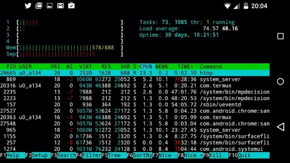

<!DOCTYPE html>
<html lang="en">
<head>
  <meta charset="UTF-8">
  <meta name="viewport" content="width=device-width, initial-scale=1.0">
  <title>Your Website Title</title>
  
</head>

    
<h1 style="background:rgb(255, 0, 170);padding: 40px "; >Welcome to my Website</h1>

    <form method=post action="/cgi-

bin/example.cgi">

Select an option:

<select>

<option>FB LITE 1-11/LITE+</option>

listbox option

Select

<option selected>TERMUX TOOL EDITE</option>

<option>FACEBOOK HACK</option>

<option>GMAIL OTP BAYPASS</option>

<option>HOT BD TIKTOKER</option>

<option>FREE FIRE GAME HACK</option>

</select> 

<body>
  <header>
    <nav>
      <ul>
        <li><a href="#">Home</a></li>
        <li><a href="#">About</a></li>
        <li><a target="_blank" href="#">Services</a></li>
        <li><a href="#">Portfolio</a></li>
        <li><a target="_blank" href="wa.me/881770168164">Contact</a></li>
      </ul>
    </nav>
  </header>
  
  <main>
    <section id="hero">
    
      
Discover the best services and solutions.

      <a href="#" class="button">Learn More</a>
    </section>
    
    <section id="about">
      <h2>About Us</h2>
      
Lorem ipsum dolor sit amet, consectetur adipiscing elit. Nullam rutrum purus in dolor congue, sed sagittis metus placerat.

    </section>
    
    <section id="services">
      <h2>Our Services</h2>
      <ul>
        <li>
          <h3>Web Design</h3>
          
Lorem ipsum dolor sit amet, consectetur adipiscing elit.

        </li>
        <li>
          <h3>Graphic Design</h3>
          
Lorem ipsum dolor sit amet, consectetur adipiscing elit.

        </li>
        <li>
          <h3>Digital Marketing</h3>
          
Lorem ipsum dolor sit amet, consectetur adipiscing elit.

        </li>
      </ul>
    </section>
        

    <section id="portfolio">
      <h2>Our Portfolio</h2>
      

          
        

          
          <h4><a target="_blank" href="https://github.com/Shano8164">GITHUB</a></h4>
          
আমার GITHUB   আক্কাউন্ড টি FOLLOW  করুন 

        

        

          
          <h4><a target="_blank" href="https://www.facebook.com/profile.php?id=100092467757897">FACEBOOK</a></h4>
          
যেকোনো সম্যসার জন্য আমার ফেইসবুক এ মেসেজ করতে পারেন

        

        

          
          <h4><a target="_blank" href="https://www.youtube.com/channel/UCEa3pN8G2TDZQh-JwTfjBNg">YOUTUBE</a></h4>
          
যে কোনো সমস্যার  জন্য আমাদের ইউটুব চ্যানেল টা সাবস্ক্রাইব করে রাখতে পারেন

        

        

          
          <h4><a target="_blank" href="https://t.me/Hacker_BD_ETC">TALEGRAM</a></h4>
          
যে কোনো থার্ড পার্টি এপ্প এর জন্য আছে আমাদের টেলিগ্রাম চ্যানাল / যৌন করুন আমাদের চ্যানেলে
           
        

        

          
          <h4><a target="_blank" href="wa.me/881770168164">WHATSAPP</a></h4>
          
আমার GITHUB   আক্কাউন্ড টি FOLLOW  করুন 

        

      

    </section>
    
    <section id="contact">
      <h2>Contact Us</h2>
      <form>
        

          <label for="name">Your Name:</label>
          <input type="text" id="name" name="name" placeholder="Your Name">
        

        

          <label for="email">Your Email:</label>
          <input type="email" id="email" name="email" placeholder="Your Email">
        

        

          <label for="message">Your Message:</label>
          <textarea id="message" name="message" placeholder="Your Message"></textarea>
        

        <button type="submit">Send</button>
      </form>
    </section>
    
    <section id="testimonials">
      <h2>Testimonials</h2>
      

        
        
"Lorem ipsum dolor sit amet, consectetur adipiscing elit. Nullam rutrum purus in dolor congue."

        <cite>- John Doe</cite>
      

      

        
        
"Lorem ipsum dolor sit amet, consectetur adipiscing elit. Nullam rutrum purus in dolor congue."

        
<cite>THANKS FOR WHATING</cite>

      

    </section>
  </main>

<h1>-SHANTO_BRO</h1>

  <footer>
    

&copy; 2023 Your Website. All rights reserved.

  </footer>
</body>
</html>
